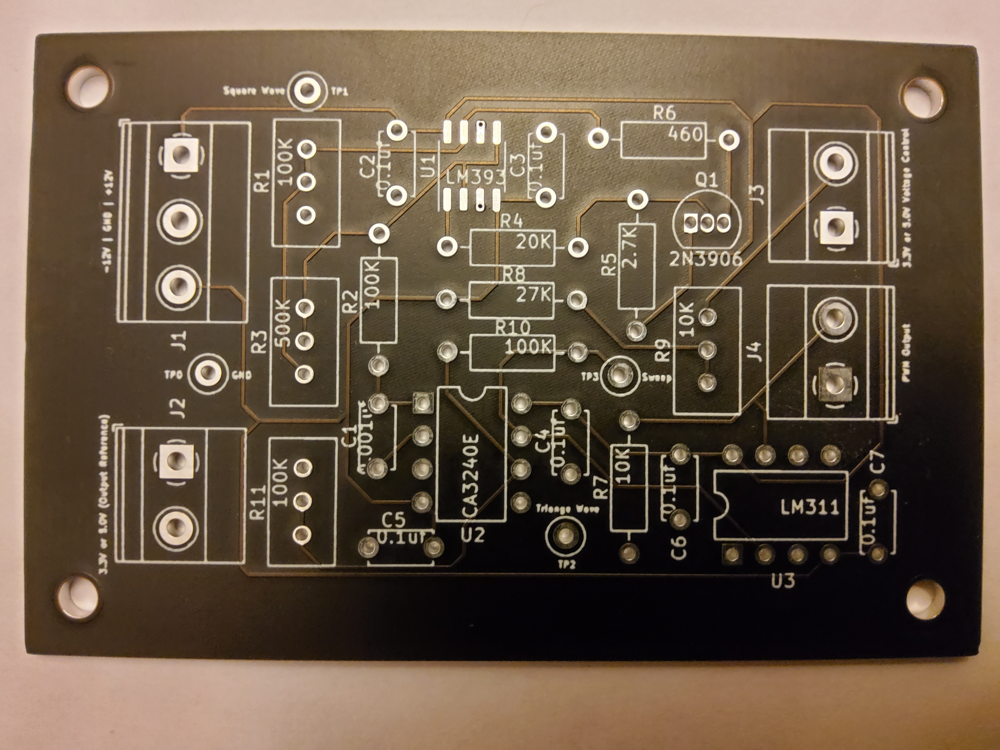
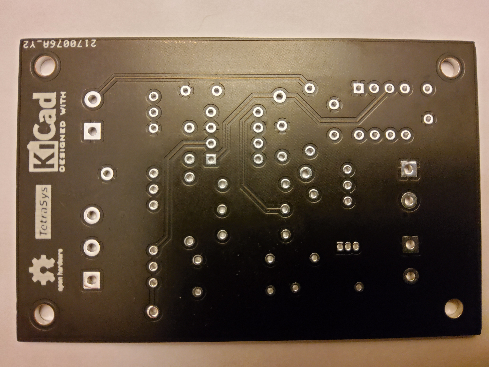
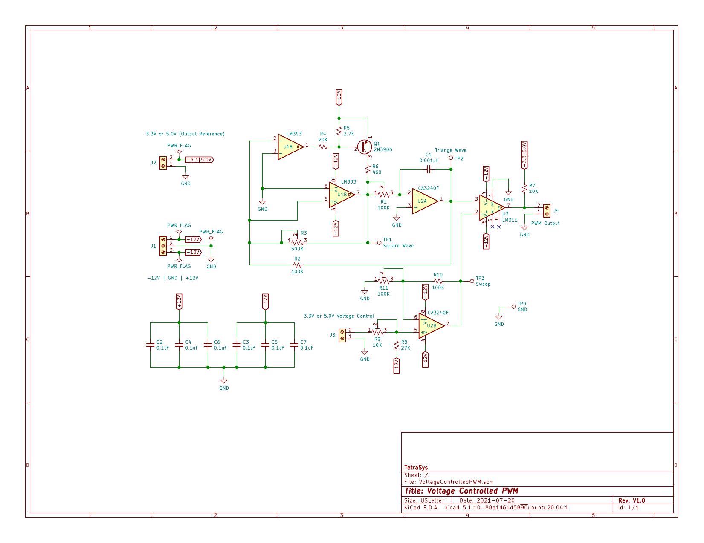

***************************************
Voltage-Controlled PWM Motor Controller
***************************************
The MIT License (MIT)

This circuit can supply either a 3.3 or 5 volt logic level PWM signal
depending on the reference voltage used. The voltage control input can also
be driven with either a 3.3 or 5 volt logic level signal depending on the
how the circuit is calibrated.

The PWM frequency can be adjusted in the range of 25K Hertz.

=======
LTspice
=======

Spice files for testing the circuit viability.

=====
KiCAD
=====

KiCAD files of the schematic and PCB.

========================
Calibration Instructions
========================

Test Equipment
--------------

  1. +12 and -12 Volt bench power supply.
  2. +5 or +3.3 Volt bench power supply.
  3. Variable voltage bench supply (0V-3.3V or 0V-5V).
  4. Multimeter
  5. Oscilloscope
  6. Frequency Counter (Optional--Can use the scope)

First be sure your dual voltage power supply is as close to +12 and -12 volts
as possible. This will also be true in the actual environment that this PWM
will call home. If there is a slight offset between the absolute + and -
voltages there will also be a slight offset between the internal triangle wave
voltage. See below.

Calibration
-----------

  1. The R3 trimmer is used to adjust the internal triangle reference voltage.
     This should nominally be 10 volts peak-to-peak with the trimmer set to
     approximately 250K. Put your scope probes between TP2 (Triangle Wave) and
     TP0 (GND) then adjust R3.
  2. The R1 trimmer is used to adjust the frequency of the triangle wave. This
     should nominally be 25K Hertz with the trimmer set to approximately 24K.
     Put your scope or frequency counter probes between TP2 (Triangle Wave)
     and TP0 (GND) then adjust R1.
  3. The R9 trimmer is used to adjust the symmetry of the sweep voltage. This
     is the Control Voltage that adjusts the modulation of the PWM frequency.
     Adjust the variable power supply to 50% of 3.3V (1.65V) or 5V (2.5V)
     depending on your drive voltage then attach the supply to J3 and attach
     the multimeter probes to TP3 (Sweep) and TP0 (GND). Double check that the
     supply voltage is at 50% of your driving voltage then adjust R9 so the
     voltage on the multimeter is as close to 0 (zero) volts as possible.
  4. The R11 trimmer is used to set the peak-to-peak of the sweep voltage. Set
     the variable power supply to your drive voltage 5V or 3.3V and attach it
     to J3 (Voltage Control Input). Attach the multimeter probes to TP3 (Sweep)
     and TP0 (GND). Adjust R11 so that the multimeter shows plus 5V. Adjust the
     supply to 0 (zero) volts (or short the two pins on J3) and check that the
     voltage on the multimeter is -5V. See note 1 below.
  5. Check the PWM. Adjust the supply voltage to 50% as was done in step 3
     above and check that the PWM is 50%, then adjust the supply to 0 (zero)
     (or just short the two pins on J3) Check that the PWM is 0 (zero) volts.

Notes:

  1. In order to get 0 (full off) and 5/3.3 Volts (full on), on the PWM the
     sweep voltage may need to be slightly more than 10V peak-to-peak keeping
     the maximum triangle wave voltage at 10V peak-to-peak.
  2. TP1 gives you a square wave output, however it is not used in the
     calibration.
  3. On Version 1 of the PCB the silk screen for the test points are rather
     small and difficult to read. This will be fixed in version 2 of the PCB.
     The photos below should help with identifying which TP is which.

==============
PCBs Version 1
==============

=========
Schematic
=========

Feel free to contact me at: carl dot nobile at gmail.com
